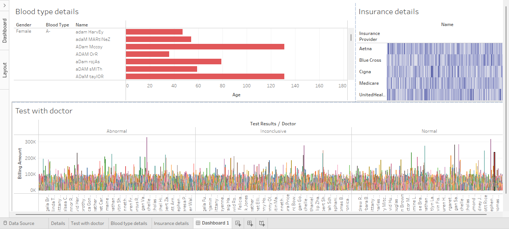

# Healthcare Data Dashboard

## Overview

This Tableau dashboard provides a comprehensive overview of healthcare data, focusing on:

1. **Blood Type Details**
2. **Insurance Details**
3. **Doctor Test Results and Billing**

The dashboard is divided into three main sections:

### 1. Blood Type Details
- Displays a horizontal bar chart representing patients with blood type **A-**.
- Shows details such as **Gender**, **Name**, and **Age**.
- Highlights the age distribution of patients filtered by blood type and gender.

### 2. Insurance Details
- Heatmap displaying patient coverage under different **Insurance Providers**:
  - Aetna
  - Blue Cross
  - Cigna
  - Medicare
  - UnitedHealthcare
- Provides a quick overview of patient count and insurance spread.

### 3. Test with Doctor
- Stacked bar chart visualizing **Billing Amounts** per doctor categorized by **Test Results**:
  - Abnormal
  - Inconclusive
  - Normal
- Helps identify high-cost doctors and the frequency of test outcomes.

## Data Source
This dashboard was created using anonymized healthcare data for analysis purposes. The dataset includes patient demographics, insurance information, and medical test billing records.

## Tools Used
- **Tableau**: For data visualization
- **Excel/CSV**: As a data source
- **Python (Optional)**: For pre-processing or advanced analytics (if applicable)

## How to Use
1. Clone the repository.
2. Open the Tableau file (`.twbx`) to interact with the dashboard.
3. Explore different filters (e.g., gender, blood type, insurance provider) to analyze the data from various perspectives
